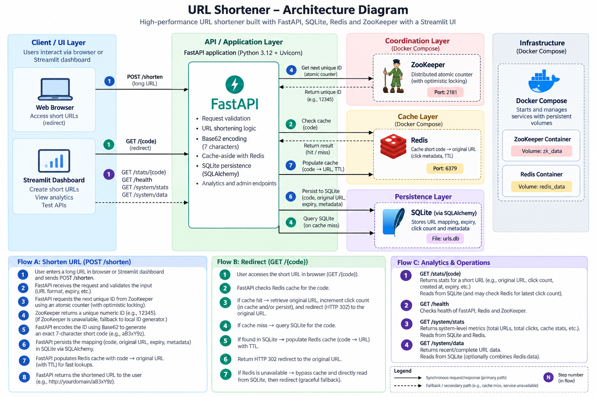

# 🔗 URL Shortener

A small-scale, high-performance URL shortener built with **FastAPI**, **Redis**, and **ZooKeeper**, featuring a full graphical testing dashboard via **Streamlit**.

## Architecture Diagram


## Features

- **Blazing Fast API**: Built on top of FastAPI and Uvicorn.
- **Distributed ID Generation**: Uses an atomic counter in Apache ZooKeeper (via optimistic locking) to eliminate ID collisions in distributed deployments. (Includes a seamless local-fallback when ZK is unavailable).
- **Efficient Encoding**: Converts unique IDs to exactly 7-character URLs using Base-62 encoding.
- **Cache-Aside Architecture**: Frequently accessed URLs are cached in Redis. If Redis goes down, the system degrades gracefully and fetches directly from the SQLite database.
- **Analytics & Tracking**: Tracks individual click counts, expiry times, and creation dates.
- **Interactive UI Dashboard**: Streamlit interface to instantly shorten URLs, simulate redirects, view per-URL analytics, and monitor live system metrics (interactive charts for Redis / ZooKeeper).

## Tech Stack

- **Backend**: Python 3.12, FastAPI, SQLAlchemy (SQLite)
- **Cache**: Redis
- **Coordination**: Apache ZooKeeper
- **Frontend / UI**: Streamlit, Pandas, Altair
- **Containerization**: Docker & Docker Compose (for backing services)

## Quick Start (Local Setup)

1. **Spin up backing services (Redis & ZooKeeper)**
   This uses persistent Docker volumes, so your data safely survives container restarts.
   ```bash
   docker compose up -d
   ```

2. **Install remaining dependencies (if not already using a virtual environment)**
   ```bash
   pip install -r requirements.txt
   ```

3. **Start the API Backend**
   ```bash
   uvicorn app:app --reload
   ```

4. **Start the Testing UI Dashboard**
   In a new terminal:
   ```bash
   streamlit run ui.py
   ```

5. Go to **http://localhost:8501** in your browser to interact with the application seamlessly!

## API Endpoints

| Method | Endpoint | Description |
|---|---|---|
| `POST` | `/shorten` | Shortens a URL (`original_url`, optional `expiry_hours`). |
| `GET` | `/{code}` | Redirects user to the original URL and tracks the click. |
| `GET` | `/stats/{code}` | Returns click count and metadata for a specific shortcode. |
| `GET` | `/health` | Reports overall connectivity (Database, Redis, ZooKeeper). |
| `GET` | `/system/stats` | Dumps live analytics from backing services for the UI. |
| `GET` | `/system/data` | Dumps raw stored keys/nodes from Redis & ZooKeeper. |

## License

[MIT License](LICENSE)
